<p align="center">
  <a href="https://www.beyondata.com/">
    
  </a>
</p>

<h1 align="center">DeepSeek Harness Studio</h1>

<p align="center">
  <a href="https://github.com/fufankeji/deepseek-harness-studio/stargazers"></a>
  
  
  
  
  
  
  
  <a href="LICENSE"></a>
  
</p>

<p align="center"><a href="https://www.beyondata.com/"><strong>官方网站</strong></a> · <strong>中文</strong> · <a href="README.en.md">English</a></p>

<p align="center"><strong>赋范空间出品 · DeepSeek Harness 的零代码桌面增强</strong></p>

<p align="center"><strong>视觉增强 + 本地模型 + 插件市场 + Preset 广场 · 0 代码一键部署和使用</strong></p>

<p align="center">自动发现并推送生态新插件，AI 智能推荐值得安装的能力；无需命令行即可完成搜索、校验、安装、启停与卸载。</p>

<p align="center"><a href="https://github.com/fufankeji/deepseek-harness-studio/releases/download/desktop-preview-v0.1.0-rc.19/DeepSeek-Harness-Desktop-0.1.0-rc.19-macos-arm64-preview.zip"><strong>下载 macOS arm64 开发预览版</strong></a> · <a href="https://github.com/fufankeji/deepseek-harness-studio/releases/download/desktop-preview-v0.1.0-rc.19/DeepSeek-Harness-Desktop-Windows-x64-0.1.0-rc.19-Setup.exe"><strong>下载 Windows x64 开发预览版</strong></a></p>

<p align="center">
  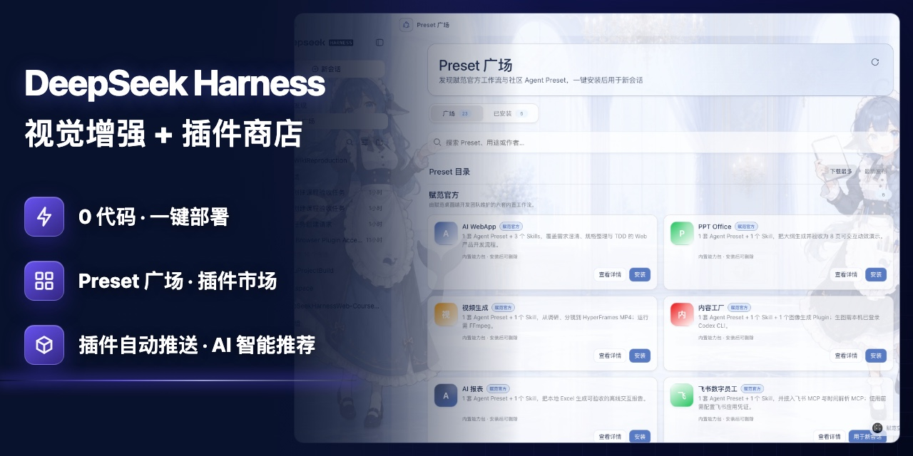
</p>

<p align="center">
  <strong>点击快速查看功能演示</strong>
</p>

https://github.com/user-attachments/assets/0717f7c7-a872-4d2b-acc2-3a1c4874c732

## 核心功能

> 下表只列已经进入源码、桌面组合和用户操作链路的能力；远期设想不再与现有功能混排。

| 能力 | 可以做什么 |
| --- | --- |
| **桌面工作区与会话管理** | 使用原生目录选择打开本地项目，按 Workspace 管理和搜索会话，并完成重命名、归档、Fork 与历史接续。 |
| **长会话目录与全文跳转** | 在对话右侧按用户、助手和工具生成完整历史目录；点击摘要会自动加载尚未渲染的旧消息，收起目录并跳转、高亮对应完整原文。 |
| **插件发现与 Agent 推荐** | 浏览精选、最近更新和生态热门插件，按场景筛选或搜索，也可以直接描述需求让 Agent 从公开 `dsh-plugin` 目录筛选候选。 |
| **插件可信安装与生命周期恢复** | 安装前检查确定版本、权限、兼容性与风险，安装后统一启用、停用、更新和卸载；未完成事务会自动回滚，运行清单仍不一致时进入可停用／卸载的插件安全模式。 |
| **Preset 广场与七套内置工作流** | 浏览赋范官方与社区 Agent Preset，查看 Skills、工具和环境要求后安装，并从“已安装”直接用于新会话。 |
| **应用中心与 FF–LLM Wiki** | 从独立一级入口启动拥有专属界面、数据和运行流程的完整 AI 应用，并按需显示应用侧边栏快捷入口。 |
| **多模型与本地推理** | 配置 DeepSeek 与其他兼容提供方，或从一级入口连接 Ollama、vLLM、SGLang 和自定义 OpenAI-compatible 服务。 |
| **原生视觉、兼容视觉与图片附件** | 使用 DeepSeek 图文模型直接处理图片，或调用已验证的云端／自托管视觉路线；图片附件会持久保存并沿单一路径发送。 |
| **Plan、Goal、Todo、Jobs 与 Workflow** | 进入规划模式，管理目标和待办，查看当前进程中的后台任务，并在对话中复盘多阶段 Workflow 的成员状态。 |
| **SubAgent 与多 Agent 协作** | 创建一次性或可继续的子 Agent，查看父子会话谱系、运行状态和耗时，并在支持的子会话中继续交流或停止当前轮次。 |
| **项目规则、上下文引用与产出文件** | 读取仓库指令，使用 `@file`／`@session` 引用上下文，并在回答末尾查看、打开或定位 Agent 实际产出的文件。 |
| **权限、沙箱与人工确认** | 为当前或后续会话选择只读、工作区写入和完全访问；危险权限、工具审批和 Agent 主动提问都在界面中显式确认。 |
| **主题皮肤与跨平台桌面交付** | 切换内置或本地背景并自动适配界面配色；通过 GitHub Releases 获取 macOS arm64 与 Windows x64 预览包。 |

## 近期路线图

> 以下能力尚未形成完整的一等产品入口，不计入当前功能。

| 方向 | 计划补齐的产品能力 |
| --- | --- |
| **独立能力中心** | 为不依赖 Bundle 包装的 MCP Server、Skills 与工具提供单独的发现、连接和项目级组合管理。 |
| **可视化 Agent 编排** | 在现有 Preset 与 SubAgent 运行能力之上，提供自定义 Agent、角色分工和团队流程编辑器。 |
| **远程控制与自动化** | 在明确权限和审计边界后，补齐浏览器／桌面操作、移动端接续和消息通知入口。 |

## 项目简介

DeepSeek Harness Studio 使用 Electron 承载 DeepSeek Harness 的 Web 工作区，并由桌面主进程启动和管理本地 `dsh web` 服务。这个仓库提供完整源码开发环境，使用者可以从 GitHub 克隆或下载代码，在本地安装依赖、编辑源码、启动桌面应用并继续开发。

桌面安装包只通过本仓库的 GitHub Releases 发布，不使用第三方下载站。目前已经提供经过真实 Electron 验收的 macOS arm64 预览 ZIP 和 Windows x64 预览安装程序；需要继续开发时，仍可获取完整源码并在本地启动。

## Workspace 与 Agent 执行能力

- **Workspace 和会话**：原生选择本地目录；按 Workspace 分组、搜索和删除登记；会话支持重命名、归档和在最后一个完成轮次处 Fork。
- **长会话目录**：右侧轻量目录覆盖当前会话的完整历史，而正文仍按页加载；目录摘要最多 80 字，点击未加载项目会自动连续翻页，定位后收起面板并高亮完整消息。
- **计划与工作管理**：通过 Plan、Goal 和 Todo 组织当前任务；Jobs 面板展示当前进程内的后台任务，进程重启后不会把这些运行中任务继续当作存活任务。
- **Workflow 与 SubAgent**：对话记录会展示 Workflow 的阶段、成员和结局；SubAgent 目录支持父子谱系导航、继续对话，以及停止运行中可继续子会话的当前轮次。
- **引用与交付物**：`@file` 和 `@session` 把文件或会话作为上下文；成功产出的文件会出现在回答末尾，并可通过本地 Host 打开或在文件夹中定位。
- **人机协作**：Agent 可以发起结构化单选、多选或自定义问题；工具审批、完全访问和计划评审都要求用户在界面中明确作答。
- **安全边界**：权限预设把沙箱模式与审批策略固定到会话；凭据经只写接口保存，页面不会读取或回显已经存储的密钥值。

## DeepSeek Harness v0.1.1-rc.2 兼容能力

Studio `0.1.0-rc.19` 已整合 DeepSeek Harness `0.1.1-rc.2` 的核心与 Web 能力，同时保留赋范的插件中心、插件发现、Preset 广场、应用中心、主题皮肤和桌面恢复链路。Studio 版本号与 Harness 上游版本号分别管理；页面顶部下载链接与本版本一致。

- **多模态能力**：保留 Pro／Flash 文本模型，接入 `DeepSeek-V4-Flash-Vision-Exp`、可持久图片附件和 Files API 图片复用；失效引用会有界重传，解析失败时整次请求回退为受限内联图片。
- **Agent 运行能力**：接入 `@` 文件／会话引用、Plan、Goal、后台 Jobs、Workflow、SubAgent、并发 Web Search 与 Windows 持久 PowerShell PTY。
- **桌面适配**：Host 使用 `--no-open`，保留原生目录选择、插件事务恢复和既有用户数据目录；历史插件锁文件不兼容时自动进入不改写锁文件的兼容恢复。

## 插件生态：先发现值得装的，再完成安装与管理

### 插件发现：不知道装什么，就从这里开始

不知道插件去哪里找、哪些最近刚更新、哪些正在受到生态关注？从左侧进入 **插件发现**，应用会自动读取在线目录，把分散的插件整理成可以直接浏览和行动的推荐页面。

<p align="center">
  
  <br><sub>真实 Desktop 界面：目录精选、最近更新、生态热门、场景分类、搜索以及安装与管理入口。</sub>
</p>

- **每天都有新发现**：打开页面即可看到目录精选、最近更新和生态热门，不必逐个仓库搜索。
- **按场景快速筛选**：覆盖 Agent 与工作流、Web UI、浏览器与搜索、视觉与媒体、记忆与上下文、模型与服务、开发工具、集成与通知。
- **直接搜索答案**：按插件名称、功能关键词或作者检索，并查看头像、简介、版本和更新时间。
- **发现后立即使用**：未安装插件可直接进入安全安装流程；已安装插件可一键转到插件中心继续管理。

### 不知道准确包名？让 Agent 先替你筛选

只知道“想要一个桌面宠物”这类需求时，不必先猜 npm 包名。在 **插件发现** 中输入自然语言描述，应用会把它作为 `/find-plugins` 请求交给当前 Agent；Agent 加载内置技能、只读查询公开 `dsh-plugin` 目录，并把最相关的候选、版本、作者、更新时间和匹配理由返回当前对话。

<p align="center">
  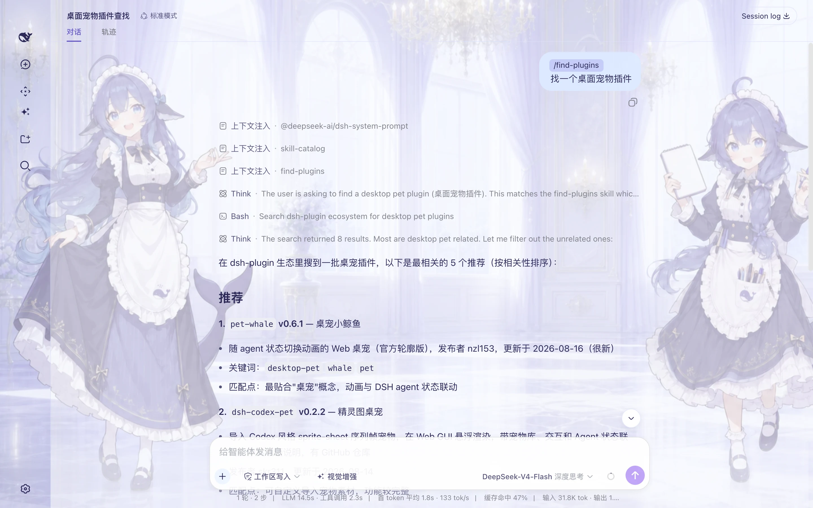
  <br><sub>真实 Desktop 验收：对话发出“找一个桌面宠物插件”，Agent 加载 <code>find-plugins</code>、执行公开目录搜索，并从 8 个结果中列出 5 个相关候选。</sub>
</p>

- **不要求记住关键词**：直接说明目标、使用场景或希望解决的问题。
- **推荐依据可核对**：结果包含精确包名、版本、发布者、更新时间和逐项匹配理由。
- **搜索与安装分开确认**：推荐结果只代表公开目录元数据；选定包名后仍通过 **插件中心** 完成兼容性检查和确认安装。

### 插件中心：在线安装、启停与移除

<p align="center">
  
  <br><sub>真实 Desktop 界面：插件头像、公开目录、已安装区域、“安装”按钮与三点管理入口。</sub>
</p>

选定插件后进入 **插件中心**，可以用短包名、完整 npm 包名或明确 GitHub 仓库查找发布到 npm 公共 Registry 的插件与 Skill Pack。`dsh-plugin` 只是发现信号；GitHub 也只用于映射已发布 npm 包，Studio 不会直接安装仓库源码。确定版本仍须通过 Bundle、完整性和运行兼容校验。

- **在线发现**：搜索公开插件，查看版本、能力、权限、兼容性和风险说明。
- **一键安装**：下载确定版本并校验包身份、完整性和 Bundle 声明；确认后自动安装并重启 Harness Host 验证运行状态。
- **已安装管理**：集中查看系统、公开目录和本地来源，通过三点菜单启用、停用、更新或卸载插件。
- **安全移除**：卸载默认保留配置与插件数据；需要清理数据时，再由用户单独确认。

## Preset 广场已上线：一键安装完整工作方式

插件通常解决“让 Agent 多一个工具”，Skill 解决“教 Agent 按什么方法做”，而 **Agent Preset** 解决的是更完整的问题：把角色、工作规则、Skills、Plugin/MCP 与 Harness 标准工具组合成一套可以反复使用的工作方式。用户不需要逐项理解和手工配置，安装一个 Preset 后，就能直接用对应角色创建新会话。

| 能力层 | 它是什么 | 主要解决什么 |
| --- | --- | --- |
| **Skill** | 可复用的方法、步骤与约束 | 告诉 Agent 一类任务应该“怎么做” |
| **Plugin / MCP** | 可执行工具或外部服务连接 | 让 Agent 能真实读写系统、调用服务并完成动作 |
| **Agent Preset** | 角色、Skill、工具与运行规则的组合 | 把零散能力装配成一套开箱即用的数字员工或工作流 |

当前源码已经提供与“插件中心”“插件发现”平级的 **Preset 广场**，并完成发现、详情、安全安装、已安装管理、用于新会话、删除与重新安装的桌面端闭环。

<p align="center">
  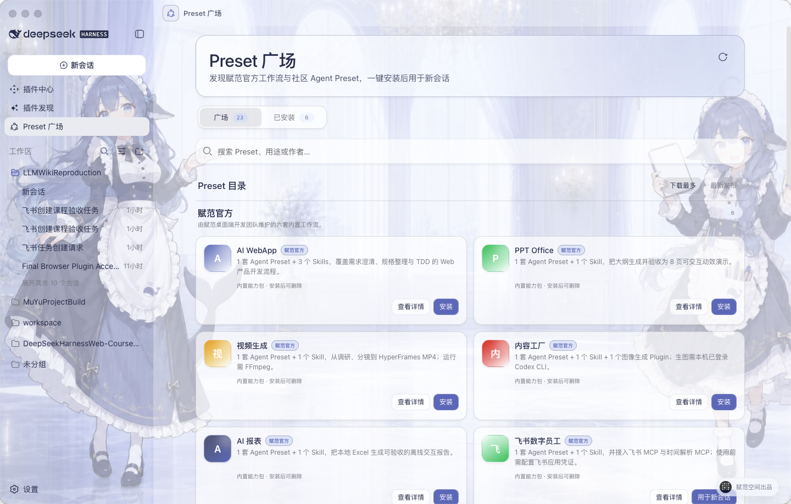
  <br><sub>真实 Desktop 界面：Preset 广场、赋范官方内置目录、搜索与排序，以及安装、查看详情和用于新会话入口。</sub>
</p>

> **使用路径：** 发现 Preset → 查看能力组成与前置条件 → 一键安装 → 在“已安装”中选择“用于新会话” → 按工作流完成任务 → 随时删除或重新安装。

1. 从左侧导航进入 **Preset 广场**，可搜索用途、名称或作者，并按下载量或更新时间排序。
2. 打开详情查看它包含的角色、Skill、工具、外部依赖和来源说明。
3. 点击安装后，Desktop 会校验来源、大小、摘要和归档路径，再写入本地用户 Preset 目录。
4. 安装完成后无需重启 Host；在 **已安装** 中点击“用于新会话”，即可带着对应 Preset 开始任务。
5. 用户 Preset 可删除并重新安装；系统 Preset 继续受保护。安装或删除后仍停留在当前页面，不打断浏览过程。

> 安装、删除和用于新会话涉及本机文件与 Host，只在 Desktop 中执行；浏览器开发模式用于快速查看和验收界面，不会修改本机 Preset。

## 赋范官方内置 Preset：七套真实场景工作流

内置内容不是“插件合集”，而是七套围绕真实交付结果组织的 **Agent Preset + Skills + 工具集成**。合计包含 **7 套 Agent Preset、9 个 Skills、1 个图像生成 Plugin**；飞书数字员工另外接入飞书 MCP 与时间解析 MCP，PPT Office 使用内置动效运行适配器。

> **命名说明：** “赋范官方”表示由赋范桌面端开发团队内置和维护，不代表 DeepSeek Harness 官方。它们安装后仍是普通用户 Preset，可以删除并重新安装。

| 分类 | 内置 Preset | 能力组成 | 直接交付 |
| --- | --- | --- | --- |
| 产品与应用开发 | AI WebApp | 1 Preset + 3 Skills | 从需求澄清、规格整理到 TDD 验收的可运行 Web 产品 |
| 办公与演示 | PPT Office | 1 Preset + 1 Skill + 动效运行适配器 | 8 页、四主题、可交互的单文件 HTML 演示文稿 |
| 视觉与媒体 | 视频生成 | 1 Preset + 1 Skill | 从一句话调研、分镜到渲染完成的 16:9 MP4 |
| 内容生产 | 内容工厂 | 1 Preset + 1 Skill + 1 图像生成 Plugin | 从长文分析到 1–10 张风格一致的图文卡片 |
| 数据分析 | AI 报表 | 1 Preset + 1 Skill | 从本地 Excel 生成可核验的离线交互报告 |
| 企业协同 | 飞书数字员工 | 1 Preset + 1 Skill + 飞书 MCP + 时间解析 MCP | 从自然语言指令到真实飞书任务与双端回执 |
| 知识库研发 | LLM Wiki Producer | 1 Preset + 1 Skill | 使用「LLM Wiki 全栈工程师」按阶段开发、验证并交付企业知识库项目 |

> 下方六个案例统一使用 `16:10` 预览图，避免横幅和长图破坏版面；点击任意图片可查看完整原图。

### 产品与演示：把想法变成可交付成果

<table>
  <tr>
    <td width="50%" align="center"><a href="assets/presets/ai-webapp.png">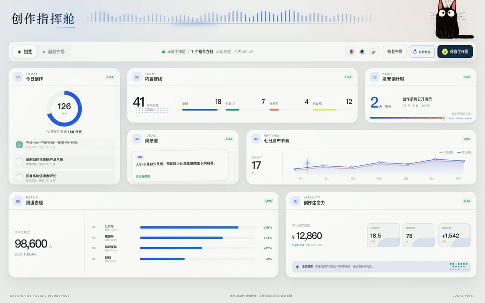</a></td>
    <td width="50%" align="center"><a href="assets/presets/ppt-office.png">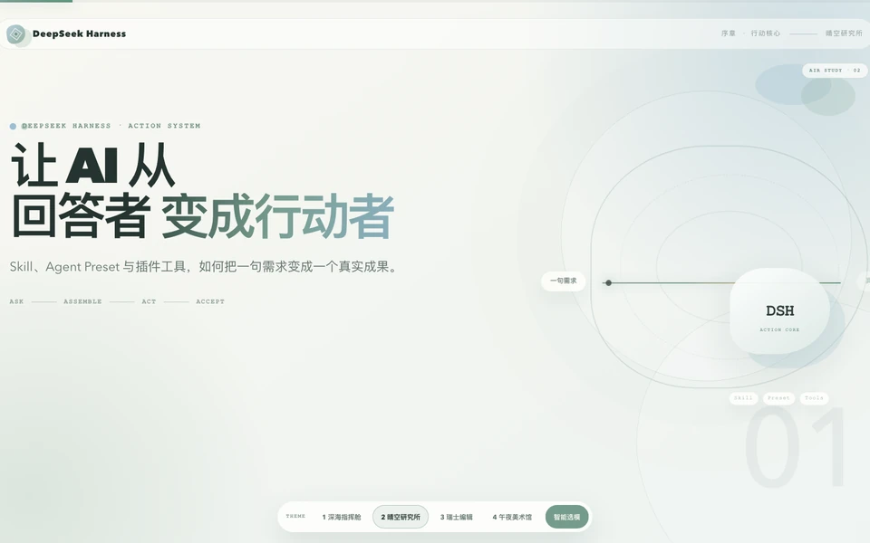</a></td>
  </tr>
  <tr>
    <td valign="top">
      <strong>01 · AI WebApp</strong><br>
      <strong>解决什么：</strong>需求讨论结束后，仍不知道如何稳定落成一个可运行、可测试的 Web 产品。<br>
      <strong>功能逻辑：</strong>需求澄清 → 规格整理 → TDD 纵向开发 → 类型检查、构建与浏览器验收。<br>
      <strong>能力组成：</strong><code>grill-me</code>、<code>to-spec</code>、<code>tdd</code> 3 个 Skills + 专属产品开发 Preset。<br>
      <strong>示例结果：</strong>可启动、可拖拽、可更新数据的“创作指挥舱”WebApp。
    </td>
    <td valign="top">
      <strong>02 · PPT Office</strong><br>
      <strong>解决什么：</strong>只有主题和内容大纲时，快速形成结构完整、视觉统一、可离线播放的演示成果。<br>
      <strong>功能逻辑：</strong>保存原始内容 → 组织 8 页叙事大纲 → 选择主题并生成 → 确定性检查页数、动画与离线性。<br>
      <strong>能力组成：</strong>1 个动效演示 Skill + 专属导演 Preset + 内置动效运行适配器。<br>
      <strong>示例结果：</strong>四套主题、逐页语义动画的单文件 HTML；当前明确不生成 <code>.pptx</code>。
    </td>
  </tr>
</table>

### 内容与媒体：把一句话或一篇长文变成成品

<table>
  <tr>
    <td width="50%" align="center"><a href="assets/presets/video-generation.jpg">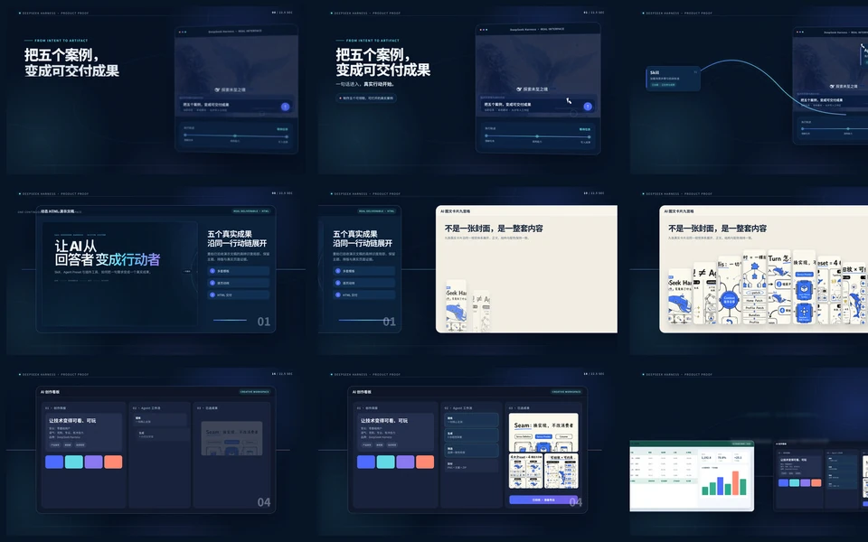</a></td>
    <td width="50%" align="center"><a href="assets/presets/content-factory.jpg">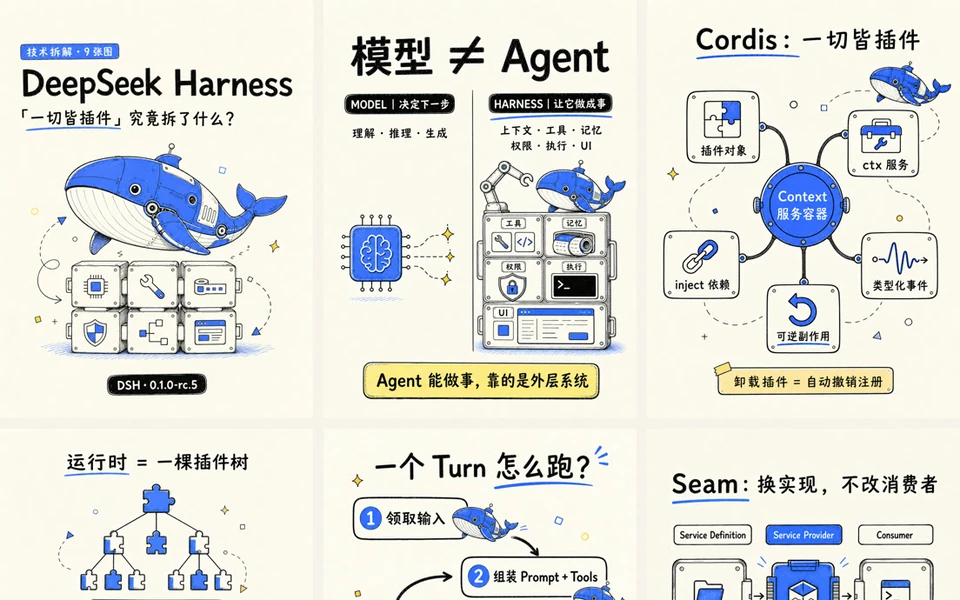</a></td>
  </tr>
  <tr>
    <td valign="top">
      <strong>03 · 视频生成</strong><br>
      <strong>解决什么：</strong>只有一句产品想法时，仍能建立从事实调研到正式成片的完整生产链。<br>
      <strong>功能逻辑：</strong>四维 Web 检索 → 研究与简报 → 设计规范、分镜和视频源码 → HyperFrames 检查 → FFmpeg 渲染与媒体验收。<br>
      <strong>能力组成：</strong>1 个产品发布片 Skill + 专属视频导演 Preset。<br>
      <strong>示例结果：</strong>可编辑视频工程、联系表和 16:9 MP4；运行环境需要 FFmpeg 与 ffprobe。
    </td>
    <td valign="top">
      <strong>04 · 内容工厂</strong><br>
      <strong>解决什么：</strong>把一篇长文稳定拆解成风格统一、可以连续发布的系列视觉内容。<br>
      <strong>功能逻辑：</strong>分析受众与观点 → 确认风格、布局和配色 → 编写系列大纲与逐图提示 → 生成 1–10 张图片 → 校验尺寸、页数与一致性。<br>
      <strong>能力组成：</strong>1 个图文 Skill + 专属内容视觉 Preset + Codex ImageGen Bridge Plugin。<br>
      <strong>示例结果：</strong>9 张连续图文卡片；真实生图前需要本机 Codex CLI 已登录并具备 ImageGen 能力。
    </td>
  </tr>
</table>

### 数据与企业协同：从本地数据到真实业务动作

<table>
  <tr>
    <td width="50%" align="center"><a href="assets/presets/ai-report.png"></a></td>
    <td width="50%" align="center"><a href="assets/presets/feishu-digital-employee.png">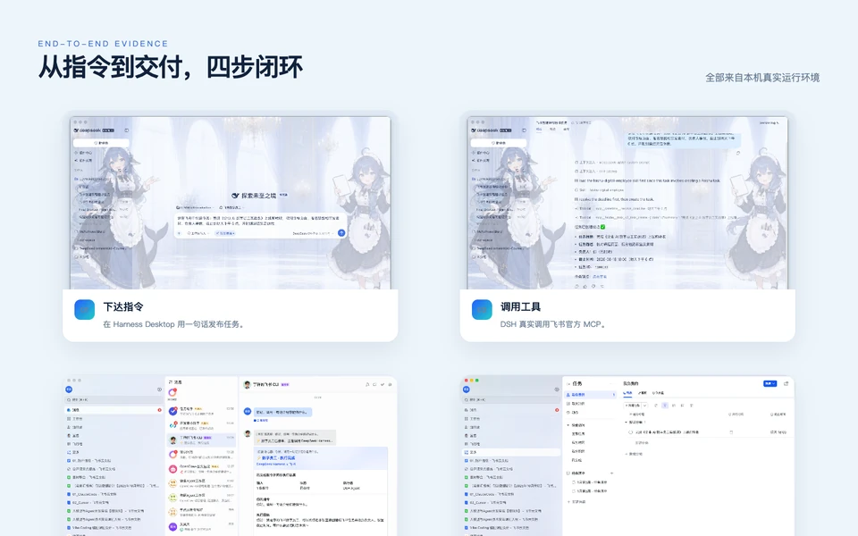</a></td>
  </tr>
  <tr>
    <td valign="top">
      <strong>05 · AI 报表</strong><br>
      <strong>解决什么：</strong>把本地 Excel 从“原始表格”转成结构清晰、可追溯、可直接交付的数据叙事。<br>
      <strong>功能逻辑：</strong>只读核对工作簿与数据基线 → 清洗聚合 → 选择图表叙事 → 内联 ECharts 生成 → 桌面与移动双端验收。<br>
      <strong>能力组成：</strong>1 个 Excel 报表 Skill + 专属数据分析 Preset。<br>
      <strong>示例结果：</strong>不依赖 CDN 的单文件交互 HTML，原始 Excel 保持只读，报告只嵌入聚合数据。
    </td>
    <td valign="top">
      <strong>06 · 飞书数字员工</strong><br>
      <strong>解决什么：</strong>让对话不止返回文字，而是把一句自然语言真正变成企业协作系统中的任务。<br>
      <strong>功能逻辑：</strong>Harness Desktop 或飞书接收指令 → Skill 判断动作 → 时间 MCP 解析“明天下午 6 点” → 飞书官方 MCP 创建任务 → Harness 与飞书双端返回回执。<br>
      <strong>能力组成：</strong>1 个飞书 Skill + 专属数字员工 Preset + 飞书 MCP + 时间解析 MCP。<br>
      <strong>示例结果：</strong>真实飞书任务、负责人和截止时间均可查看；首次使用需要配置飞书应用凭据与默认负责人。
    </td>
  </tr>
</table>

以上图片均来自六套工作流的真实案例成果。Desktop 随安装包交付的是运行所需的精简 Preset、Skills 与工具适配，不会把案例源码、输入数据、截图或生成成品塞进用户环境。

## 应用中心已上线：从能力扩展进入完整 AI 应用

插件为 Harness 增加工具或界面能力，Preset 把角色、Skills 与工具组合成一套工作方式，而 **应用** 面向更完整的产品场景：它拥有独立界面、专属数据和自己的运行流程。应用中心因此与插件中心、插件发现和 Preset 广场平级，用户不需要在插件列表中辨认技术包，直接从一个稳定入口发现并启动完整产品。

| 形态 | 主要作用 | 典型使用方式 |
| --- | --- | --- |
| **Plugin / MCP** | 增加可调用工具、服务连接或局部界面能力 | 安装后由 Agent 或 Harness 功能触发 |
| **Agent Preset** | 组合角色、Skills、工具与工作规则 | 用 Preset 创建新会话并按既定流程完成任务 |
| **AI 应用** | 提供专属界面、数据和端到端业务流程 | 从应用中心直接打开并持续管理自己的业务数据 |

<p align="center">
  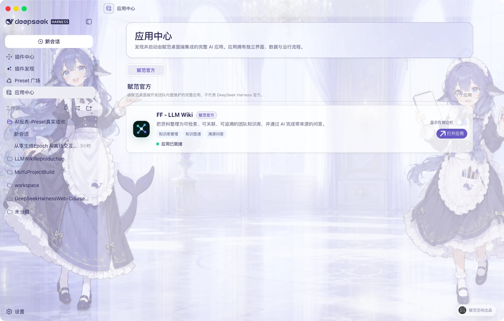
  <br><sub>真实 Desktop 界面：应用中心作为一级入口展示赋范官方应用；可直接打开应用，也可选择是否把快捷入口显示在左侧导航。</sub>
</p>

### 首个内置应用：FF–LLM Wiki 企业知识库

FF–LLM Wiki 面向企业文档分散、知识关系难整理、问答结果无法追溯的问题，把原始资料逐步转换为可检索、可关联、可核查的知识资产。它不是嵌在对话页中的演示卡片，而是一套由 Desktop 管理本地运行环境、在系统浏览器中打开的完整应用。

<p align="center">
  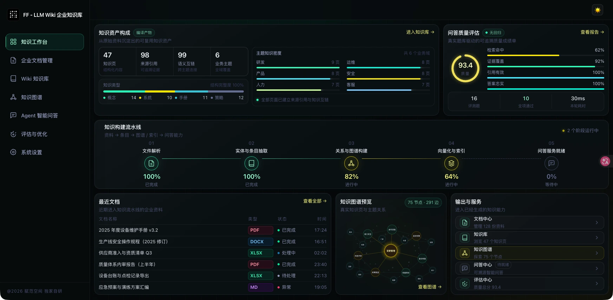
  <br><sub>真实运行界面：从文档解析、Wiki 编译和知识图谱构建，到基于检索证据的 Agent 问答与质量评估。</sub>
</p>

- **完整知识流水线**：文档解析 → 实体与条目抽取 → Wiki 与知识图谱构建 → 向量化和索引 → 可追溯问答。
- **来源可以核查**：问答只使用当前检索命中的证据片段，并保留来源引用；模型不可用时会明确降级到本地检索结果。
- **本地数据隔离**：文档、Wiki、图谱和 SQLite 数据写入 DSH Home 下的应用专属目录，不混入当前项目工作区。
- **密钥由用户掌控**：应用不会携带赋范团队的 API Key。知识编译、浏览和本地检索无需模型密钥；使用 DeepSeek 生成式 RAG 前，需要用户在 Harness 凭证中心配置自己的 `DEEPSEEK_API_KEY`。
- **入口按需显示**：应用中心始终可访问；FF–LLM Wiki 的左侧快捷入口默认关闭，用户可通过“显示在侧边栏”随时开启或隐藏。

> **使用路径：** 打开应用中心 → 选择 FF–LLM Wiki → 点击“打开应用” → 导入或管理企业资料 → 构建 Wiki 与知识图谱 → 在智能问答中核查带来源的答案。

> **命名说明：** “赋范官方”表示由赋范桌面端开发团队内置和维护，不代表 DeepSeek Harness 官方。

## 内置皮肤与自由换肤

进入 **设置 → 背景** 即可切换内置皮肤；选择自定义图片时，应用会在本机完成 1920×1080 WebP 裁切与界面配色，不上传原图。

<table>
  <tr>
    <td width="50%" align="center">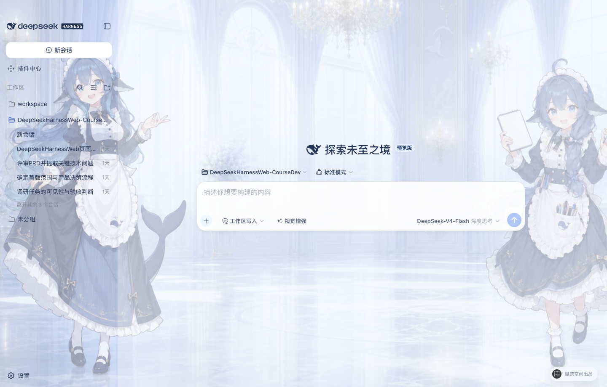</td>
    <td width="50%" align="center"></td>
  </tr>
  <tr>
    <td><strong>大肥鱼拟人 · 默认</strong><br>蓝白鲸灵助手与明亮宫殿，中央留白适配对话区。</td>
    <td><strong>云端猫咪</strong><br>保留原有柔和蓝白猫咪主题，清爽、安静、低干扰。</td>
  </tr>
</table>

## 模型、权限与思考模式

- **权限选择**：输入区使用 `只读`、`工作区写入` 和 `完全访问` 三档中文权限，作用于当前会话；通用设置只决定后续新会话的默认权限，启用完全访问前必须确认风险。
- **模型与思考模式**：模型和 API Key 仍在设置页统一管理；右侧模型选择器显示当前主模型，点击“视觉增强”后会直接变为 `DeepSeek-V4-Flash-Vision-Exp`。

## 本地模型与自托管推理

Studio 已支持通过标准 OpenAI-compatible 接口接入本机或局域网中的模型服务。用户负责先启动推理服务并准备模型；Studio 不会自动下载模型、占用额外磁盘部署权重，也不会替用户管理 GPU 运行参数。

| 框架 | 默认 API Base | 接入方式 |
| --- | --- | --- |
| **Ollama** | `http://127.0.0.1:11434/v1` | 使用 Ollama 的 OpenAI compatibility 接口，填写实际模型 ID；本地 API Key 可留空。 |
| **vLLM** | `http://127.0.0.1:8000/v1` | 连接 vLLM OpenAI-compatible server，填写已加载的模型 ID 和可选 API Key。 |
| **SGLang** | `http://127.0.0.1:30000/v1` | 连接 SGLang OpenAI-compatible endpoint，填写已启动的模型 ID 和可选 API Key。 |
| **自定义服务** | 用户填写 | 支持其他兼容 `/v1/chat/completions` 的 HTTP(S) 服务。 |

- **普通对话模型**：打开 **设置 → 模型 → 添加本地模型**，直接选择 Ollama、vLLM、SGLang 或 OpenAI-compatible；系统会预填 API Base，并可读取或手填模型 ID，本地 API Key 可选。
- **本地视觉模型**：从“视觉增强”配置选择 Ollama、vLLM、SGLang 或自定义服务；验证图片成功后才保存配置。
- **不静默上云**：自托管路线失败时不会自动把图片转发到百炼、OpenRouter 或其他云端提供方。

## 视觉增强：让 DeepSeek 看懂图片

`DeepSeek-V4-Flash-Vision-Exp` 是与 Pro／Flash 分开的图文模型，同时接收文本与图片，并沿用设置页中现有的 DeepSeek API Key。它不是给 Pro／Flash 单独返回图片描述的旁路；发送图片前，当前会话必须切换到该模型。纯文本模型仍可使用已完成配置与验证的百炼、OpenRouter、Ollama、vLLM、SGLang 或自定义 OpenAI-compatible 兼容视觉服务。

- **随手可用**：输入框左侧只保留一个“视觉增强”按钮；点击后，右侧主模型名称切换为 `DeepSeek-V4-Flash-Vision-Exp`。
- **明确可见**：模型列表只用“支持图片”标识图文模型；设置页把它显示为“视觉增强模型”，不再与文本默认模型混用。
- **原生图片链路**：DeepSeek Files API 会复用已上传图片；失效引用只进行有界重传，文件解析失败时整次请求使用同一份受限内联图片，不会重复发送。
- **兼容视觉链路**：自托管服务可填写 API Base、视觉模型 ID 和可选 API Key；失败时不会回退并把图片发送到云端。
- **明确关闭**：关闭开关后，图片不进入模型可见上下文；附件历史仍保留在界面中。
- **覆盖开发场景**：可理解产品截图、报错界面、设计稿、数据图表、照片和图片文字，也可以按路径读取当前工作区图片。

## 下载桌面端

> GitHub Releases 已提供经过真实 Electron 验收的 macOS Apple Silicon 预览 ZIP 和 Windows x64 预览安装程序，运行桌面端无需另行安装 Node.js 或 pnpm。当前均为开发预览资产；正式版本仍将提供完成平台签名的 macOS `.dmg` 和 Windows x64 `.exe`。

<p align="center"><a href="https://github.com/fufankeji/deepseek-harness-studio/releases/download/desktop-preview-v0.1.0-rc.19/DeepSeek-Harness-Desktop-0.1.0-rc.19-macos-arm64-preview.zip"><strong>下载 macOS arm64 预览版</strong></a> · <a href="https://github.com/fufankeji/deepseek-harness-studio/releases/download/desktop-preview-v0.1.0-rc.19/DeepSeek-Harness-Desktop-Windows-x64-0.1.0-rc.19-Setup.exe"><strong>下载 Windows x64 安装程序</strong></a></p>

### macOS arm64

下载并解压预览 ZIP 后，建议先把 `DeepSeek Harness.app` 拖入“应用程序”目录。由于当前预览包尚未经过 Apple 公证，首次打开前需要在“终端”执行：

```sh
xattr -dr com.apple.quarantine "/Applications/DeepSeek Harness.app"
open "/Applications/DeepSeek Harness.app"
```

如果应用没有放在“应用程序”目录，请把命令中的路径替换为实际路径。该命令只应用于从本仓库 GitHub Releases 下载并核验过 SHA-256 的预览包；不要用于来源不明的应用。首次成功打开后，可以像普通应用一样从 Finder 或程序坞启动。

### Windows x64

下载 `DeepSeek-Harness-Desktop-Windows-x64-0.1.0-rc.19-Setup.exe` 后直接运行安装程序。Release 的公开下载区只保留 macOS ZIP 和 Windows 安装程序；校验文件、blockmap 与平台验收记录保留在对应 GitHub Actions 构建中，避免普通用户误下载开发文件。

开发预览版使用独立 Pre-release 标签，不触发正式安装器发布。正式流程只接受与 Desktop 版本完全一致的 `desktop-v*` 标签；macOS 与 Windows 安装包分别完成平台签名验证后，GitHub 才会同时公开安装文件和 `SHA256SUMS`。

## 快速开始

### 获取源码

使用 Git 克隆仓库：

```sh
git clone https://github.com/fufankeji/deepseek-harness-studio.git
cd deepseek-harness-studio
```

也可以在 GitHub 仓库页面选择 **Code → Download ZIP**，下载并解压源码后进入项目目录。

### 环境要求

- Node.js `^22.19.0 || >=24.0.0`
- pnpm `11.7.0`

### 外部服务准备

下载源码、安装依赖和启动桌面开发环境不需要预先填写 API 密钥。需要在应用中实际调用模型时，再在设置中配置所选模型服务与凭证；凭证不要提交到 Git。

<a id="run"></a><a id="run-from-source"></a>

### 安装与启动

安装工作区依赖：

```sh
pnpm install
```

构建所需模块并启动桌面开发环境：

```sh
pnpm run dev:desktop
```

开发启动器会在相关源码或构建输入变化时重新构建；需要强制完整重建时运行：

```sh
pnpm run dev:desktop:rebuild
```

## 目录结构

```text
deepseek-harness-studio/
├── apps/
│   ├── desktop/       # Electron 主进程、preload、Host 生命周期与桌面构建脚本
│   ├── web/           # DeepSeek Harness Web 界面入口与桌面端组合
│   └── cli/           # dsh CLI、运行配置与 Agent Preset
├── packages/          # Agent、模型、工具、会话、插件和客户端能力包
├── native/            # 原生沙箱辅助模块
├── python/            # Python SDK 与相关运行时
├── examples/          # 可运行示例与配置
├── scripts/           # 构建、检查、生成和发布脚本
├── website/           # 项目文档站源码
├── vendor/            # 固定版本的 Cordis 基础源码
└── assets/            # README 使用的项目图片
```

## 常用开发命令

| 命令 | 用途 |
| --- | --- |
| `pnpm run dev:desktop` | 构建必要模块并启动 Electron 桌面应用 |
| `pnpm run dev:desktop:rebuild` | 强制完整重建后启动桌面应用 |
| `pnpm run build` | 构建 Host、客户端、Web 与桌面端 |
| `pnpm run package:desktop` | 为当前平台生成未封装桌面应用 |
| `pnpm run typecheck` | 运行 TypeScript 类型检查 |
| `pnpm run test` | 运行 Vitest 单元测试 |

## 建议阅读顺序

1. `apps/desktop/src/main.ts`：桌面应用入口、窗口、托盘和本地 Host 组合。
2. `apps/desktop/src/host-supervisor.ts`：`dsh web` 的启动、就绪检测与退出管理。
3. `apps/desktop/src/preload.ts`：Renderer 可访问的固定桌面接口。
4. `apps/web/`：桌面窗口加载的 Web 工作区。
5. `apps/cli/` 与 `packages/`：CLI 组合以及各项 Harness 能力实现。

## 与 DeepSeek Harness 的关系

本项目基于 [deepseek-ai/deepseek-harness](https://github.com/deepseek-ai/deepseek-harness) 的 Harness 核心、Cordis 插件体系和 Web 界面继续进行桌面端开发。本仓库维护 Electron 桌面入口、本地 Host 管理、桌面交互与配套开发脚本。

## 许可证

本项目使用 [MIT License](LICENSE)。第三方组件的许可证信息见 [THIRD_PARTY_NOTICES.md](THIRD_PARTY_NOTICES.md)。
